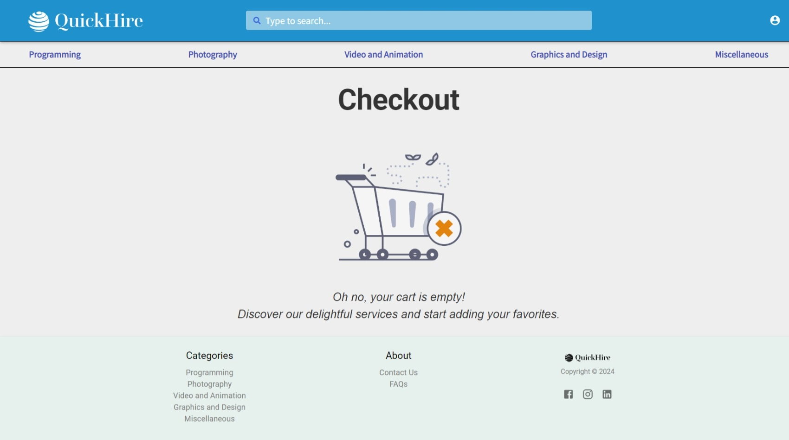
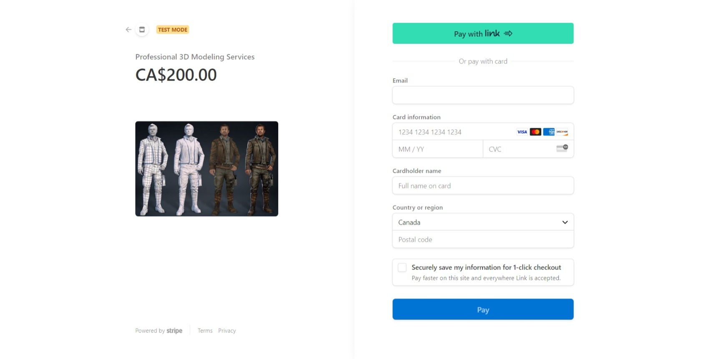
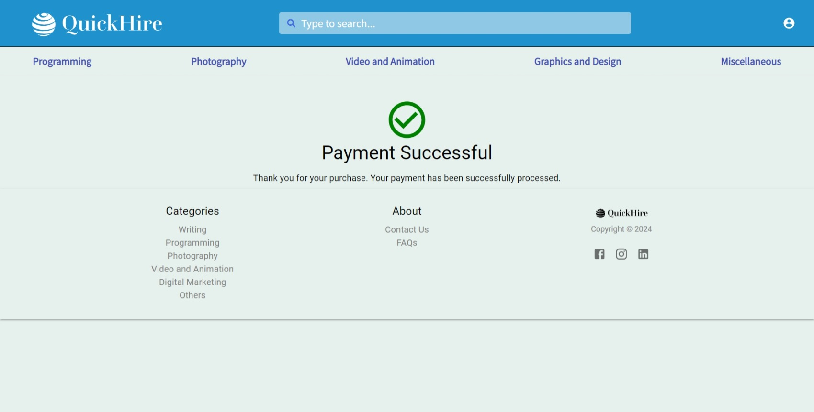
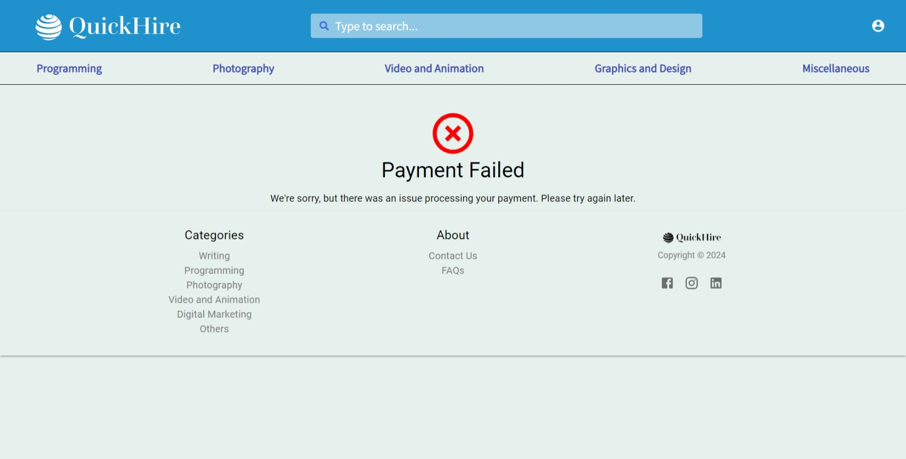
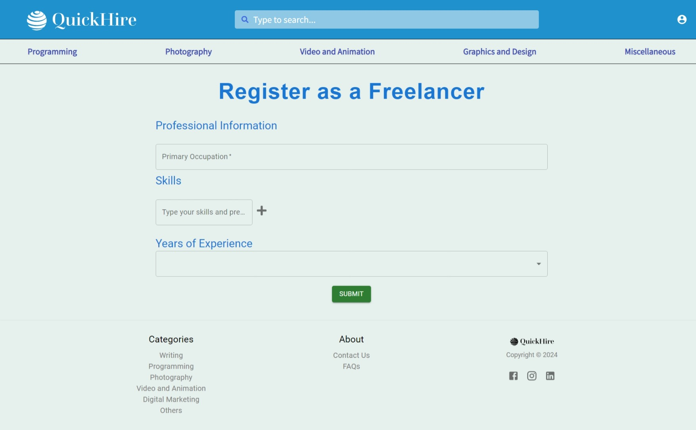

# Gitlab Repository

[https://git.cs.dal.ca/gupta2/csci_5709_grp-04](https://git.cs.dal.ca/gupta2/csci_5709_grp-04)

## Personal Branch in Repository

[https://git.cs.dal.ca/gupta2/csci_5709_grp-04/-/tree/parth-modi?ref_type=heads](https://git.cs.dal.ca/gupta2/csci_5709_grp-04/-/tree/parth-modi?ref_type=heads)

## Personal Feature 1: Checkout screen and Stripe Integration

#### URLs:

_To test the functionality, please use the following account credentials:_

- **Username:** pmodi1080
- **Password:** Test@98

**Main Website URL:** [https://quick-hire.netlify.app/](https://quick-hire.netlify.app/)

**Checkout Page (available after login):** [https://quick-hire.netlify.app/checkout](https://quick-hire.netlify.app/checkout)

**Payment Gateway:** You will be redirected to a secure Stripe page for payment processing once you click Checkout button on Checkout page.

**Payment Success:** [https://quick-hire.netlify.app/payment-success](https://quick-hire.netlify.app/payment-success)

**Payment Failure:** [https://quick-hire.netlify.app/payment-failure](https://quick-hire.netlify.app/payment-failure)

### Code Files:

#### Frontend:

- **Checkout Page (`Checkout.js`):**  
  [csci_5709_grp-04\Frontend\quickhire\src\Features\Checkout\Checkout.js](https://git.cs.dal.ca/gupta2/csci_5709_grp-04/-/blob/main/Frontend/quickhire/src/Features/Checkout/Checkout.js?ref_type=heads)

- **Payment Failure Page (`PaymentFailure.js`):**  
  [csci_5709_grp-04\Frontend\quickhire\src\Features\Payment\PaymentFailure.js](https://git.cs.dal.ca/gupta2/csci_5709_grp-04/-/blob/main/Frontend/quickhire/src/Features/Payment/PaymentFailure.js?ref_type=heads)

- **Payment Success Page (`PaymentSuccess.js`):**  
  [csci_5709_grp-04\Frontend\quickhire\src\Features\Payment\PaymentSuccess.js](https://git.cs.dal.ca/gupta2/csci_5709_grp-04/-/blob/main/Frontend/quickhire/src/Features/Payment/PaymentSuccess.js?ref_type=heads)

#### Backend:

- **Payment Routes (`payment.routes.js`):**  
  [csci_5709_grp-04\Backend\src\routes\v1\payment.routes.js](https://git.cs.dal.ca/gupta2/csci_5709_grp-04/-/blob/main/Backend/src/routes/v1/payment.routes.js?ref_type=heads)

- **Cart Controller (`cart.controller.js`):**  
  [csci_5709_grp-04\Backend\src\controllers\cart.controller.js](https://git.cs.dal.ca/gupta2/csci_5709_grp-04/-/blob/main/Backend/src/controllers/cart.controller.js?ref_type=heads)

- **Cart Model (`cart.model.js`):**  
  [csci_5709_grp-04\Backend\src\models\cart.model.js](https://git.cs.dal.ca/gupta2/csci_5709_grp-04/-/blob/main/Backend/src/models/cart.model.js?ref_type=heads)

#### Screenshots:

_Empty Cart Screen:_

_Service added to Cart:_

_Payment gateway screen (Stripe):_

_Payment Success Screen:_

_Payment Failure Screen:_

## Personal Feature 2: Register user as a Freelancer

#### URLs:

_To test the functionality, please use the following account credentials:_

- **Username:** pmodi5000
- **Password:** Test@123

_Once logged in, please go to profile page and click on "BECOME A FREELANCER" button._

**Main Website URL:** [https://quick-hire.netlify.app/](https://quick-hire.netlify.app/)

**Profile Page (available after login):** [https://quick-hire.netlify.app/profile](https://quick-hire.netlify.app/profile)

**Freelancer Registration Page:** [https://quick-hire.netlify.app/register-freelancer](https://quick-hire.netlify.app/register-freelancer)

### Code Files:

#### Frontend:

- **Register Freelancer Page (`SignUpFreelancer.js`):**  
  [csci_5709_grp-04\Frontend\quickhire\src\Features\SignUpFreelancer\SignUpFreelancer.js](https://git.cs.dal.ca/gupta2/csci_5709_grp-04/-/blob/main/Frontend/quickhire/src/Features/SignUpFreelancer/SignUpFreelancer.js?ref_type=heads)

#### Backend:

- **User Model (`user.model.js`):**
  [csci_5709_grp-04\Backend\src\models\user.model.js](https://git.cs.dal.ca/gupta2/csci_5709_grp-04/-/blob/main/Backend/src/routes/v1/payment.routes.js?ref_type=heads)

#### Screenshots:

_Freelancer Registration Screen:_

