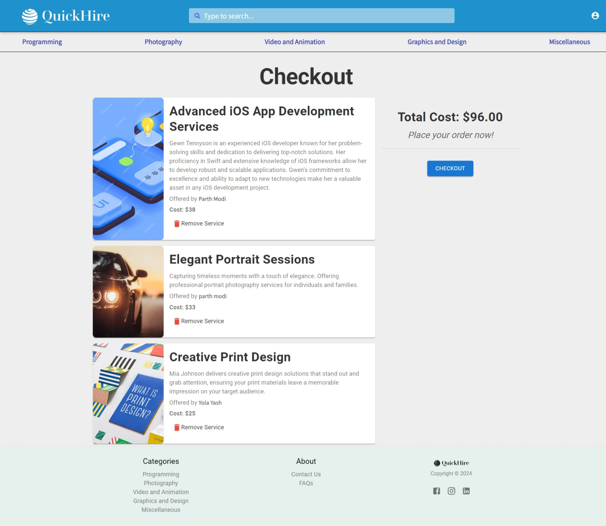
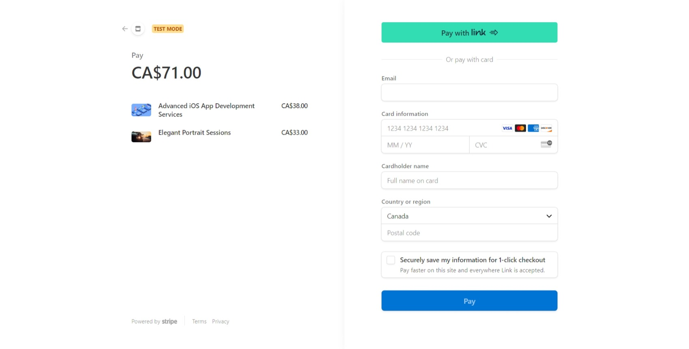

# Gitlab Repository

[https://git.cs.dal.ca/gupta2/csci_5709_grp-04](https://git.cs.dal.ca/gupta2/csci_5709_grp-04)

## Personal Branch in Repository

[https://git.cs.dal.ca/gupta2/csci_5709_grp-04/-/tree/parth-modi?ref_type=heads](https://git.cs.dal.ca/gupta2/csci_5709_grp-04/-/tree/parth-modi?ref_type=heads)

## Personal Feature 1: Checkout screen and Stripe Integration

#### URLs:

_For ease of testing the functionality, please use the following account credentials:_

- **Username:** pmodi5000
- **Password:** Test@123

- You can navigate to Checkout page from the Profile icon dropdown in Navbar once you are logged in.

**Main Website URL:** [https://quick-hire.netlify.app/](https://quick-hire.netlify.app/)

**Checkout Page (available after login):** [https://quick-hire.netlify.app/checkout](https://quick-hire.netlify.app/checkout)

**Payment Gateway:** You will be redirected to a secure Stripe page for payment processing once you click Checkout button on Checkout page.

**Payment Success:** [https://quick-hire.netlify.app/payment-success](https://quick-hire.netlify.app/payment-success)

**Payment Failure:** [https://quick-hire.netlify.app/payment-failure](https://quick-hire.netlify.app/payment-failure)

### Code Files:

#### Frontend:

- **Checkout Page (`Checkout.js`):**  
  [csci_5709_grp-04\Frontend\quickhire\src\Features\Checkout\Checkout.js](https://git.cs.dal.ca/gupta2/csci_5709_grp-04/-/blob/main/Frontend/quickhire/src/Features/Checkout/Checkout.js?ref_type=heads)

- **Payment Failure Page (`PaymentFailure.js`):**  
  [csci_5709_grp-04\Frontend\quickhire\src\Features\Payment\PaymentFailure.js](https://git.cs.dal.ca/gupta2/csci_5709_grp-04/-/blob/main/Frontend/quickhire/src/Features/Payment/PaymentFailure.js?ref_type=heads)

- **Payment Success Page (`PaymentSuccess.js`):**  
  [csci_5709_grp-04\Frontend\quickhire\src\Features\Payment\PaymentSuccess.js](https://git.cs.dal.ca/gupta2/csci_5709_grp-04/-/blob/main/Frontend/quickhire/src/Features/Payment/PaymentSuccess.js?ref_type=heads)

#### Backend:

- **Payment Routes (`payment.routes.js`):**  
  [csci_5709_grp-04\Backend\src\routes\v1\payment.routes.js](https://git.cs.dal.ca/gupta2/csci_5709_grp-04/-/blob/main/Backend/src/routes/v1/payment.routes.js?ref_type=heads)

- **Cart Controller (`cart.controller.js`):**  
  [csci_5709_grp-04\Backend\src\controllers\cart.controller.js](https://git.cs.dal.ca/gupta2/csci_5709_grp-04/-/blob/main/Backend/src/controllers/cart.controller.js?ref_type=heads)

- **Cart Model (`cart.model.js`):**  
  [csci_5709_grp-04\Backend\src\models\cart.model.js](https://git.cs.dal.ca/gupta2/csci_5709_grp-04/-/blob/main/Backend/src/models/cart.model.js?ref_type=heads)

- **Cart APIs Endpoint:**  
  **Domain:** [https://quickhire-backend-1.onrender.com/api/v1/](https://quickhire-backend-1.onrender.com/api/v1/)
  
  - **Add Service to Cart:**
    - **Method:** POST
    - **Endpoint:** /cart/add/
    - **Payload:**
      ```json
      {
        "userId": "660da06d82f1d2214ebe9798", // this is the user of the given user account
        "serviceId": "65fe53d82c89d2a6dbbb3828"
      }
      ```
    - **Response:**
      ```json
      {
          "_id": "660de136446294422f57c402", 
          "userId": "660da06d82f1d2214ebe9798",
          "services": [
              "65fd2ac82c89d2a6dbbb37fd",
              "65fe53d82c89d2a6dbbb3828"
          ],
          "totalPrice": 71,
          "__v": 5
      }
      ```
  
  - **Remove Service from Cart:**
    - **Method:** POST
    - **Endpoint:** /cart/remove
    - **Payload:**
      ```json
      {
        "userId": "660423ed59de39016941dcd2",
        "serviceId": "65fe53a22c89d2a6dbbb381b"
      }
      ```
    - **Response:**
      ```json
      {
          "_id": "660de136446294422f57c402",
          "userId": "660da06d82f1d2214ebe9798",
          "services": [
              "65fd2ac82c89d2a6dbbb37fd"
          ],
          "totalPrice": 38,
          "__v": 6
      }
      ```
  
  - **Get User Cart:**
    - **Method:** GET
    - **Endpoint:** /cart/{userId}
    - **Sample Response:**
      ```json
      {
          "_id": "660de136446294422f57c402",
          "userId": "660da06d82f1d2214ebe9798",
          "services": [
              {
                  "_id": "65fd2ac82c89d2a6dbbb37fd",
                  "sellerName": "Gewn Tennyson",
                  "title": "Advanced iOS App Development Services",
                  "description": "Gewn Tennyson is an experienced iOS developer known for her problem-solving skills and dedication to delivering top-notch solutions. Her proficiency in Swift and extensive knowledge of iOS frameworks allow her to develop robust and scalable applications. Gwen's commitment to excellence and ability to adapt to new technologies make her a valuable asset in any iOS development project.",
                  "category": "Programming",
                  "subCategory": "Mobile App Development",
                  "jobTitle": "iOS App Developer (Mobile)",
                  "price": 38,
                  "isActive": true,
                  "sellerId": "660d9af2070aa7711e0311f6",
                  "imgUrl": "https://img.freepik.com/free-vector/mobile-app-development-isometric-background-with-composition-smartphone-screens-with-3d-app-icons-connections-vector-illustration_1284-77301.jpg?t=st=1711074754~exp=1711078354~hmac=d7a10c78fbfb2e0278064a532d4f414cb56e259636f08ba7bfb61a0c473b8e7c&w=1480",
                  "createdDate": "2024-03-22T06:52:56.189Z",
                  "updatedDate": "2024-03-22T06:52:56.189Z",
                  "currentRating": 4.1,
                  "isPopular": false,
                  "numberOfRatings": 147
              }
          ],
          "totalPrice": 38,
          "__v": 0
      }
      ```

#### Screenshots:

_Empty Cart Screen:_


_Service added to Cart:_



_Payment gateway screen (Stripe):_



_Payment Success Screen:_


_Payment Failure Screen:_


## Personal Feature 2: Register user as a Freelancer

#### URLs:

_To test the functionality, please use the following account credentials:_

- **Username:** pmodi5000
- **Password:** Test@123

_Once logged in, please go to profile page and click on "BECOME A FREELANCER" button._

**Main Website URL:** [https://quick-hire.netlify.app/](https://quick-hire.netlify.app/)

**Profile Page (available after login):** [https://quick-hire.netlify.app/profile](https://quick-hire.netlify.app/profile)

**Freelancer Registration Page:** [https://quick-hire.netlify.app/register-freelancer](https://quick-hire.netlify.app/register-freelancer)

### Code Files:

#### Frontend:

- **Register Freelancer Page (`SignUpFreelancer.js`):**  
  [csci_5709_grp-04\Frontend\quickhire\src\Features\SignUpFreelancer\SignUpFreelancer.js](https://git.cs.dal.ca/gupta2/csci_5709_grp-04/-/blob/main/Frontend/quickhire/src/Features/SignUpFreelancer/SignUpFreelancer.js?ref_type=heads)

#### Backend:

- **User Model (`user.model.js`):**
  [csci_5709_grp-04\Backend\src\models\user.model.js](https://git.cs.dal.ca/gupta2/csci_5709_grp-04/-/blob/main/Backend/src/routes/v1/payment.routes.js?ref_type=heads)

#### Screenshots:

_Freelancer Registration Screen:_


